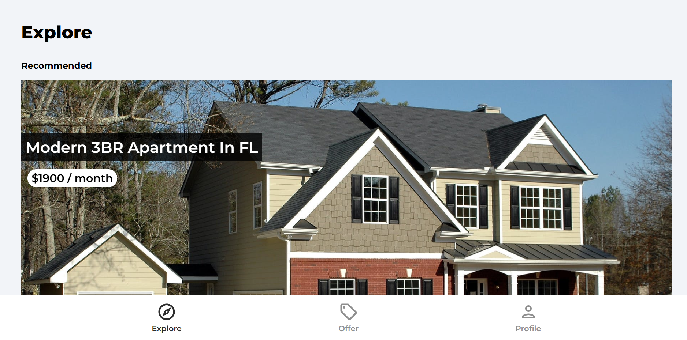

# 🏡 House Marketplace 



A full-stack, mobile-friendly React web application for browsing, creating, and managing real estate listings. This project was built to deliver a seamless user experience for exploring properties, featuring interactive mapping, secure authentication, and dynamic image galleries.

> **View the live project here:** [House Marketplace on Vercel](https://house-marketplace-two-nu.vercel.app/)

## ✨ Key Features

* **Modern Authentication:** Secure user sign-up, log-in, and password resets utilizing Firebase Authentication, including Google OAuth integration.
* **Full CRUD Functionality:** Users can seamlessly Create, Read, Update, and Delete their property listings, with data securely managed via Firebase Firestore.
* **Geocoding & Interactive Maps:** Integrated the Google Geocoding API alongside React Leaflet to automatically translate property addresses into precise map pins.
* **Dynamic Media Galleries:** Utilized modern Swiper.js modules to build touch-responsive, fluid image carousels for property photos hosted on Firebase Storage.
* **Protected Routing:** Implemented custom React Router v6 hooks to secure profile settings and listing creation pages, ensuring state-based access control.
* **Automated Data Fetching:** Built a dynamic homepage slider that queries the database to automatically display the five most recently added properties.

## 🛠️ Technical Stack

* **Frontend:** React.js, CSS3
* **Build Tool:** Vite (configured with SVGR plugins for optimized icon rendering)
* **Routing:** React Router DOM v6
* **Backend & Database:** Firebase V9 (Firestore, Storage, Authentication)
* **Mapping:** React Leaflet, Leaflet.js, Google Maps Geocoding API
* **UI Components:** Swiper (v9+)

## 🚀 Local Installation & Setup

To run this project locally, follow these steps:

1. **Clone the repository**
   ```
   git clone [https://github.com/penina26/house-marketplace.git](https://github.com/penina26/house-marketplace.git)
   cd house-marketplace
   ```
2. **Install dependencies**
```
npm install
```

3. **Configure Environment Variables** <br>

Create a .env file in the root directory and add your API credentials. *(Ensure this file is added to your `.gitignore` to protect your keys).* <br>

```
VITE_FIREBASE_API_KEY=your_firebase_api_key
VITE_GEOCODE_API_KEY=your_google_maps_api_key
```

4. **Start the development server** <br>

```
npm run dev

```
## 🔒 Security Architecture

This platform utilizes robust Firestore Security Rules to maintain database integrity. The rules are structured to ensure that read access is public for browsing, but write, update, and delete operations strictly require authenticated tokens (request.auth != null) that match the specific listing's userRef.

## 👩‍💻 About the Author

**Penina Wanyama** Data Scientist & IT Operations | MSc in Data Science | BSc in Applied Computer Science

Bridging the gap between robust backend data architecture and responsive frontend user interfaces. This project reflects my ongoing focus on building secure, scalable, and data-driven web applications using modern React and Python patterns.